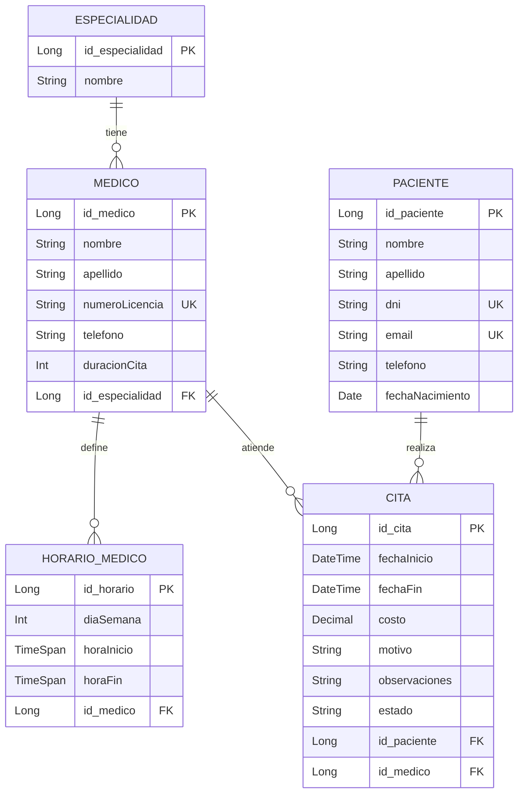

<a id="readme-top"></a>

[![Contributors][contributors-shield]][contributors-url]
[![LinkedIn][linkedin-shield]][linkedin-url]

<br />
<div align="center">
  <h1 align="center">API de Gestión de Citas Médicas</h1>

  <p align="center">
    API REST desarrollada en .NET 10 para la gestión de citas médicas, pacientes, médicos, especialidades y horarios.
    <br />
  </p>
</div>

---

<!-- TABLE OF CONTENTS -->
<details>
  <summary>Tabla de Contenidos</summary>
  <ol>
    <li><a href="#sobre-el-proyecto">Sobre el Proyecto</a></li>
    <li><a href="#construido-con">Construido Con</a></li>
    <li>
      <a href="#primeros-pasos">Primeros Pasos</a>
      <ul>
        <li><a href="#requisitos-previos">Requisitos Previos</a></li>
        <li><a href="#instalación">Instalación</a></li>
      </ul>
    </li>
    <li><a href="#uso">Uso y Endpoints</a></li>
    <li><a href="#modelo-de-datos">Modelo de Datos</a></li>
    <li><a href="#contacto">Contacto</a></li>
  </ol>
</details>

---

## Sobre el Proyecto

[![Vista del proyecto][product-screenshot]](https://github.com/redox11223/ServiciosWebPreliminar)

API REST para la administración de un sistema de citas médicas. Permite gestionar el ciclo completo: registrar especialidades, dar de alta médicos con sus horarios de atención, registrar pacientes y agendar citas validando disponibilidad en tiempo real.

**Características principales:**
- Validación de disponibilidad del médico al crear una cita (horario + conflictos con otras citas)
- Duración de cita configurable por médico
- Control de estados de cita: `Confirmada`, `Cancelada`, `Completada`
- Documentación interactiva vía Scalar UI en desarrollo

<p align="right">(<a href="#readme-top">back to top</a>)</p>

---

## Construido Con

* [![.NET][dotnet-shield]][dotnet-url]
* [![CSharp][csharp-shield]][csharp-url]
* [![Scalar][scalar-shield]][scalar-url]

<p align="right">(<a href="#readme-top">back to top</a>)</p>

---

## Primeros Pasos

### Requisitos Previos

* [.NET 10 SDK](https://dotnet.microsoft.com/download/dotnet/10.0)

### Instalación

1. Clonar el repositorio
   ```sh
   git clone https://github.com/redox11223/ServiciosWebPreliminar.git
   ```
2. Ir al directorio del proyecto
   ```sh
   cd ServiciosWebPreliminar
   ```
3. Restaurar dependencias y compilar
   ```sh
   dotnet build
   ```
4. Ejecutar la API
   ```sh
   dotnet run
   ```
5. Abrir la documentación interactiva en el navegador
   ```
   https://localhost:5121/scalar
   ```

<p align="right">(<a href="#readme-top">back to top</a>)</p>

---

## Uso

La API sigue el orden de dependencias para crear datos. El flujo recomendado es:

```
Especialidad → Médico → Horario del Médico → Paciente → Cita
```

### Endpoints disponibles

| Método | Ruta | Descripción |
|--------|------|-------------|
| `POST` | `/api/especialidad` | Crear especialidad |
| `GET` | `/api/especialidad` | Listar especialidades |
| `GET` | `/api/especialidad/{id}` | Obtener especialidad |
| `PUT` | `/api/especialidad/{id}` | Actualizar especialidad |
| `DELETE` | `/api/especialidad/{id}` | Eliminar especialidad |
| `POST` | `/api/medico` | Crear médico |
| `GET` | `/api/medico` | Listar médicos |
| `GET` | `/api/medico/{id}` | Obtener médico |
| `PUT` | `/api/medico/{id}` | Actualizar médico |
| `DELETE` | `/api/medico/{id}` | Eliminar médico |
| `POST` | `/api/horariomedico` | Crear horario |
| `GET` | `/api/horariomedico` | Listar horarios |
| `GET` | `/api/horariomedico/{id}` | Obtener horario |
| `GET` | `/api/horariomedico/medico/{medicoId}` | Horarios por médico |
| `PUT` | `/api/horariomedico/{id}` | Actualizar horario |
| `DELETE` | `/api/horariomedico/{id}` | Eliminar horario |
| `POST` | `/api/paciente` | Crear paciente |
| `GET` | `/api/paciente` | Listar pacientes |
| `GET` | `/api/paciente/{id}` | Obtener paciente |
| `PUT` | `/api/paciente/{id}` | Actualizar paciente |
| `DELETE` | `/api/paciente/{id}` | Eliminar paciente |
| `POST` | `/api/cita` | Crear cita |
| `GET` | `/api/cita` | Listar citas |
| `GET` | `/api/cita/{id}` | Obtener cita |
| `PUT` | `/api/cita/{id}` | Actualizar cita |
| `DELETE` | `/api/cita/{id}` | Eliminar cita |

<p align="right">(<a href="#readme-top">back to top</a>)</p>

---

## Modelo de Datos



<p align="right">(<a href="#readme-top">back to top</a>)</p>

---

## Contacto

Project Link: [https://github.com/redox11223/ServiciosWebPreliminar](https://github.com/redox11223/ServiciosWebPreliminar)

<p align="right">(<a href="#readme-top">back to top</a>)</p>

---

<!-- MARKDOWN LINKS & IMAGES -->
[contributors-url]: https://github.com/MartinTrillo22
[contributors-url]: https://github.com/DevSer12
[linkedin-url]: https://www.linkedin.com/in/miguel-angel-lermo-621374107/
[contributors-shield]: https://img.shields.io/github/contributors/redox11223/ServiciosWebPreliminar.svg?style=for-the-badge
[contributors-url]: https://github.com/redox11223/ServiciosWebPreliminar/graphs/contributors
[forks-shield]: https://img.shields.io/github/forks/redox11223/ServiciosWebPreliminar.svg?style=for-the-badge
[forks-url]: https://github.com/redox11223/ServiciosWebPreliminar/network/members
[stars-shield]: https://img.shields.io/github/stars/redox11223/ServiciosWebPreliminar.svg?style=for-the-badge
[stars-url]: https://github.com/redox11223/ServiciosWebPreliminar/stargazers
[issues-shield]: https://img.shields.io/github/issues/redox11223/ServiciosWebPreliminar.svg?style=for-the-badge
[issues-url]: https://github.com/redox11223/ServiciosWebPreliminar/issues
[linkedin-shield]: https://img.shields.io/badge/-LinkedIn-black.svg?style=for-the-badge&logo=linkedin&colorB=555
[linkedin-url]: https://linkedin.com/in/linkedin_username
[product-screenshot]: img/logo.png
[dotnet-shield]: https://img.shields.io/badge/.NET_10-512BD4?style=for-the-badge&logo=dotnet&logoColor=white
[dotnet-url]: https://dotnet.microsoft.com/
[csharp-shield]: https://img.shields.io/badge/C%23-239120?style=for-the-badge&logo=csharp&logoColor=white
[csharp-url]: https://learn.microsoft.com/en-us/dotnet/csharp/
[scalar-shield]: https://img.shields.io/badge/Scalar-000000?style=for-the-badge&logo=scalar&logoColor=white
[scalar-url]: https://scalar.com/ 
